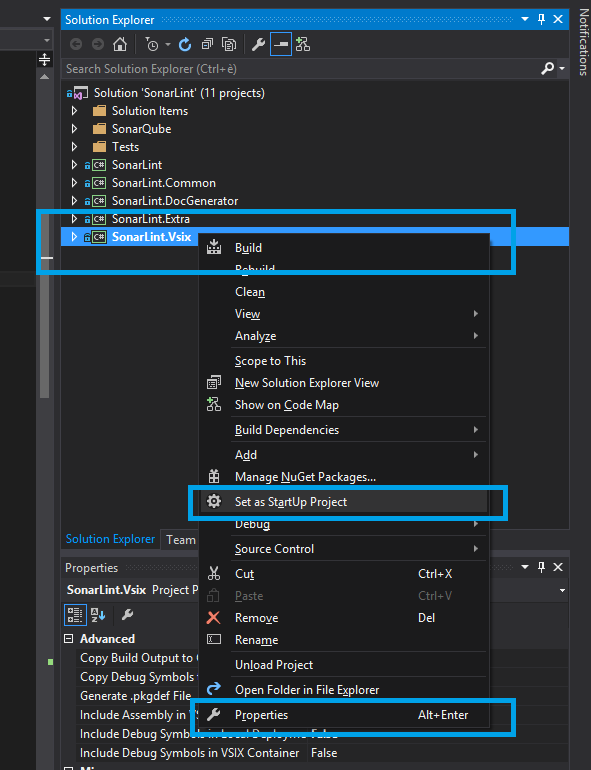
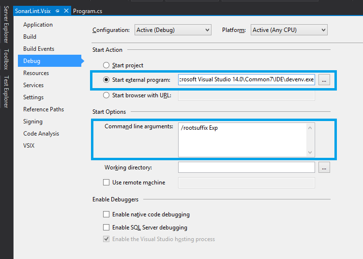

# How to manually validate a rule?

1. In the Solution Explorer, right click SonarLint.Vsix and set it as the start-up project.

	

2. In the SonarLint.Vsix Debug Properties, set the external program to start to the experimental instance of `devenv.exe`.

	

3. Hit `F5` to launch the experimental instance of Visual Studio with the .vsix deployed.

4. Open one of the following solutions:

	* [Akka.NET](akka.net-dev_8b00423b29/src/Akka.sln)
	* [Nancy](Nancy-master_6775d18fc5/src/Nancy.sln)

	These solutions have been pre-configured to use the [Validation Ruleset](ValidationRuleset.ruleset) on all their projects. The ruleset file can be found in the \_ruleset solution folder.
	

5. Turn on your new rule in that ruleset, review the results, improve, and send the pull request out once your are satisfied!

The remaining solutions in this folder are analyzed by the automated [Ruling Integration Test](../src/Tests/SonarLint.RulingTest/RulingTest.cs).
